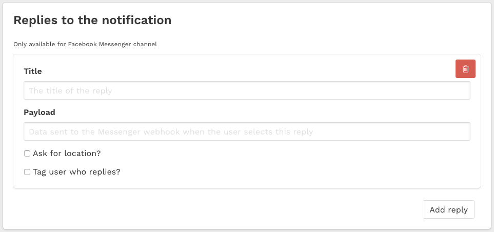

.. _triggers:

=================
Trigger Campaigns
=================

In **10darts** you can set up campaigns that will be sent when the user behaves in pre-determined manner, i.e.: accesses
for the first time, has not accessed in certain number of days, etc. Each of these events is a trigger.

Once you have chosen a *trigger* you will have to define the campaign (message to use, deep link, user segmentation,
etc.) with a *template*.

First Access
------------

This trigger takes place when a user **accesses your platform for the first time**. When selecting this trigger
you will have to determine the number of seconds that will lapse until the new user receives your
campaign. Its main purpose is to welcome the user into your platform.

Last Access
-----------

This trigger happens **after a user does not interact with your platform** in the number of days that you determine.
**10darts** runs daily a users check to determine when each user accessed your platform for the last time.
Its purpose is to avoid a user forgetting about your platform because he does not receive any communication from you.

Reply Selection
---------------

This trigger occurs after **a user replies to a campaign**. When selecting it, you'll have to determine the specific
reply that the user will have to select to get the campaign. Its purpose is to increase user engagement.

